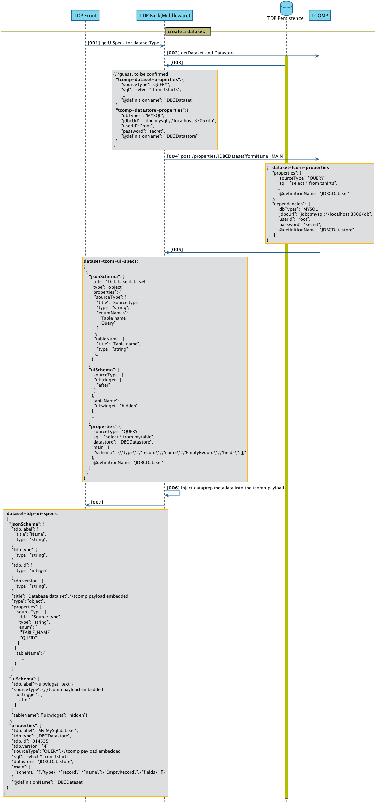
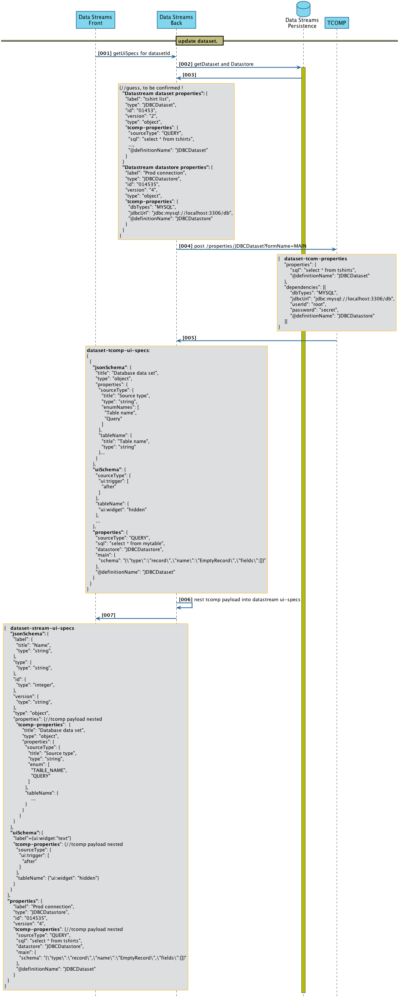

Modifying a Dataset instance
=====================

here we can see the different approach taken by dataprep and datastream of how each app adds their own specific metadata to an tcomp dataset.

### 1) The Dataprep way
Summary
* **[003]** retrieve dataset and datastore properties from dataprep storage.
* **[004]** Get the UI specs for that datastore and dataset from TCOMP. Datastore is required to initialise some of the dataset values
* **[006]** in the json-schema, the ui-schema and the properties are injected with some dataprep specific metamodel element to be displayed such as the dataset name. Those injected fields are prefixed with tdp. to avoid name colision with component fields.

The injection of dataprep specific node is done at the json parser level using jacksons ObjectNode

/!\ note that when communicating back with tcomp in the case of triggers for instance, it needs to sending back only the **properties** payload, and dataprep must remove the injected metadata fields.
 

### 2) The Datastream way 
Summary
* **[003]** retrieve dataset and datastore properties from datastream storage.
* **[004]** Get the UI specs for that datastore and dataset from TCOMP. Datastore is required to initialise some of the dataset values
* **[006]** _here it differs from dataprep_ the datastream metadata is not injected into the tcomp payload but rather the tcomp payload is nested into datastream payload. The 3 json (schema, ui, props) are all nested into a higher level schema, ui and props. 

The nesting is also done at the json parser level

/!\ note that when communicating back with tcomp in the case of triggers for instance, it needs to sending back only the **tcomp-properties** payload, so it must be extracted from the higher level *datastream-properties*.
 

